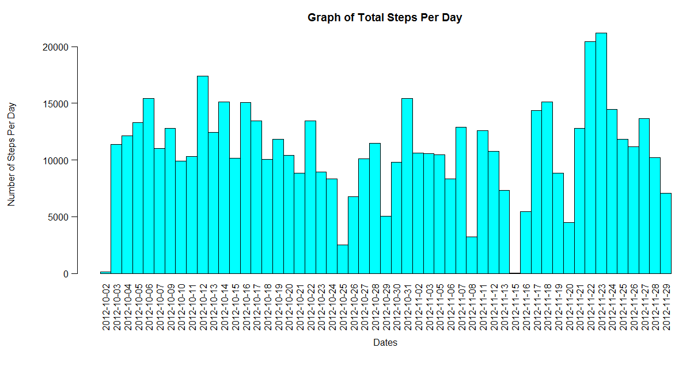
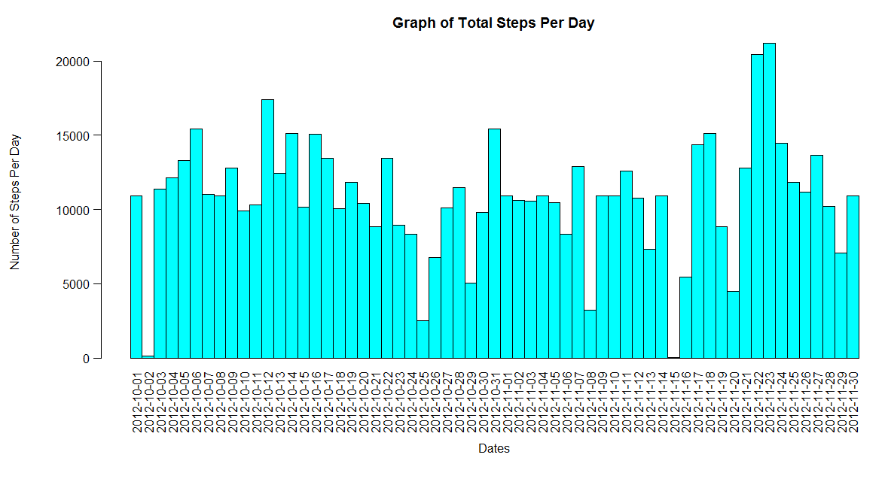
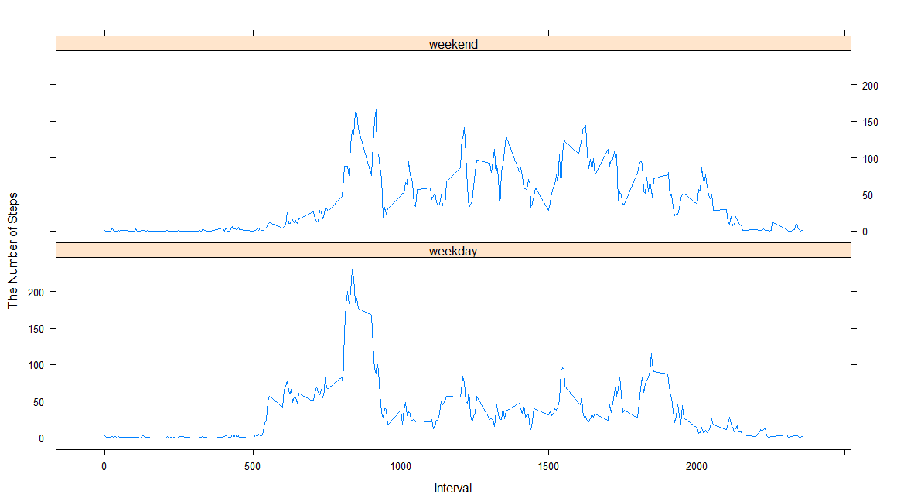

# Reproducible Research: Peer Assessment 1


## Loading and preprocessing the data


>Show any code that is needed to

>1. Load the data (i.e. read.csv())

>2. Process/transform the data (if necessary) into a format suitable for your analysis
 
 
```r
activity<-read.csv("activity.csv",header=TRUE,na.string=c("NA"," ","","   .","  /  /"))
```

Check a quick summary of the activity dataset by using the str() function and use the head() function to see the top preview of the data.


```r

str(activity)
head(activity)
```

    ```
    ##'data.frame':   17568 obs. of  3 variables:
    ## $ steps   : int  NA NA NA NA NA NA NA NA NA NA ...
    ## $ date    : Factor w/ 61 levels "2012-10-01","2012-10-02",..: 1 1 1 1 1 1 1 1 1 1 ...
    ## $ interval: int  0 5 10 15 20 25 30 35 40 45 ...
    ```

    ```
        steps       date interval
    ##1    NA 2012-10-01        0
    ##2    NA 2012-10-01        5
    ##3    NA 2012-10-01       10
    ##4    NA 2012-10-01       15
    ##5    NA 2012-10-01       20
    ##6    NA 2012-10-01       25

    ```


##What is mean total number of steps taken per day?

>For this part of the assignment, you can ignore the missing values in the dataset.

```r
steps_per_day <- aggregate(steps ~ date, data = activity, FUN = sum)

```


>The following is showing the number of steps taken per day:


```r
steps_per_day
```

```
         date steps
1  2012-10-02   126
2  2012-10-03 11352
3  2012-10-04 12116
4  2012-10-05 13294
5  2012-10-06 15420
6  2012-10-07 11015
7  2012-10-09 12811
8  2012-10-10  9900
9  2012-10-11 10304
10 2012-10-12 17382
11 2012-10-13 12426
12 2012-10-14 15098
13 2012-10-15 10139
14 2012-10-16 15084
15 2012-10-17 13452
16 2012-10-18 10056
17 2012-10-19 11829
18 2012-10-20 10395
19 2012-10-21  8821
20 2012-10-22 13460
21 2012-10-23  8918
22 2012-10-24  8355
23 2012-10-25  2492
24 2012-10-26  6778
25 2012-10-27 10119
26 2012-10-28 11458
27 2012-10-29  5018
28 2012-10-30  9819
29 2012-10-31 15414
30 2012-11-02 10600
31 2012-11-03 10571
32 2012-11-05 10439
33 2012-11-06  8334
34 2012-11-07 12883
35 2012-11-08  3219
36 2012-11-11 12608
37 2012-11-12 10765
38 2012-11-13  7336
39 2012-11-15    41
40 2012-11-16  5441
41 2012-11-17 14339
42 2012-11-18 15110
43 2012-11-19  8841
44 2012-11-20  4472
45 2012-11-21 12787
46 2012-11-22 20427
47 2012-11-23 21194
48 2012-11-24 14478
49 2012-11-25 11834
50 2012-11-26 11162
51 2012-11-27 13646
52 2012-11-28 10183
53 2012-11-29  7047
```


>1.	Make a histogram of the total number of steps taken each day

```r
with(steps_per_day, {
      par(oma=c(2,0,0,0), mar=c(7,7,3,0),mgp=c(5.5,0.75,0),las=2)
      barplot(
      height=steps,
      main="Graph of Total Steps Per Day",
      xlab="Dates",
      ylab="Number of Steps Per Day",
      col="cyan",
      names.arg=date,
      space=c(0)
    )
})
```

   


>2.	Calculate and report the mean and median total number of steps taken per day:

Mean

```r
mean_steps<-mean(steps_per_day$steps, na.rm=TRUE)
mean_steps
```
      
      ```
      ## [1] 10766
      ```

Median

```r
median_steps<-median(steps_per_day$steps, na.rm=TRUE)
median_steps
```

      ```
      ## [1] 10765
      ```


##What is the average daily activity pattern?


>1.	Make a time series plot (i.e. type = "l") of the 5-minute interval (x-axis) and the average number of steps taken, averaged across all days (y-axis)


A. Same to the previous section, these are the following steps to reach this:


```r
steps_interval <- aggregate(steps ~ interval, data = activity, FUN = mean)

colnames(steps_interval) <- c("Interval", "AvrgStepsAcrossYrs")
```


B. Now we can check a preview of this new constructed data:


```r
head(steps_interval)
```


    ```
        Interval AvrgStepsAcrossYrs
    ##1        0            1.71698
    ##2        5            0.33962
    ##3       10            0.13208
    ##4       15            0.15094
    ##5       20            0.07547
    ##6       25            2.09434

    ```

C. Now we can create a Time-Series plot from the above dataset:


```r
with(steps_interval, {
    plot(
      x=Interval,
      y=AvrgStepsAcrossYrs,
      type="l",
      main="Time-Series of Interfal and Average Steps Across Years",
      xlab="5 Minute Interval",
      ylab="Average Steps and Average Across All Days"
      )
})
```

  


>2.	Which 5-minute interval, on average across all the days in the dataset, contains the maximum number of steps?


```r
intervalMax <- steps_interval[steps_interval$AvrgStepsAcrossYrs==max(steps_interval$AvrgStepsAcrossYrs),]
```

      ```
            Interval AvrgStepsAcrossYrs
      ##104      835              206.2
      
      ```
From the output above we can see that the interval between **835** and  **840** minutes has the maximum number of steps.


##Imputing missing values


Note that there are a number of days/intervals where there are missing values (coded as NA). The presence of missing days may introduce bias into some calculations or summaries of the data.


>1. Calculate and report the total number of missing values in the dataset (i.e. the total number of rows with NAs)

```r
missings <- nrow(subset(activity, is.na(activity$steps)))
missings
```

      ```
      ##[1] 2304
      ```
      

>2. Devise a strategy for filling in all of the missing values in the dataset. The strategy does not need to be sophisticated. For example, you could use the mean/median for that day, or the mean for that 5-minute interval, etc.

```r
missings <- data.frame(activity$steps)
missings[is.na(missings),] <- ceiling(tapply(X=activity$steps,INDEX=activity$interval,FUN=mean,na.rm=TRUE))
newdata <- cbind(missings, activity[,2:3])
colnames(newdata) <- c("steps", "Date", "Interval")
```

Now preview the top of the newdata dataset:

```r
head(newdata)
```

      ```
        steps       Date Interval
      ##1     2 2012-10-01        0
      ##2     1 2012-10-01        5
      ##3     1 2012-10-01       10
      ##4     1 2012-10-01       15
      ##5     1 2012-10-01       20
      ##6     3 2012-10-01       25
      ```


>3. Create a new dataset that is equal to the original dataset but with the missing data filled in.


```r
new_steps_per_day <- aggregate(newdata$steps, list(newdata$Date), sum)
```

Now preview this new dataset:

```r
head(new_steps_per_day)
```
      ```
           Group.1     x
    ##1 2012-10-01 10909
    ##2 2012-10-02   126
    ##3 2012-10-03 11352
    ##4 2012-10-04 12116
    ##5 2012-10-05 13294
    ##6 2012-10-06 15420
    ```

Rename column x to steps_no_na and column Group.1 to dates:


```r
steps_no_na<-(new_steps_per_day$x)

dates<-(new_steps_per_day$Group.1)
```


>4. Make a histogram of the total number of steps taken each day and Calculate and report the meanand median total number of steps taken per day. Do these values differ from the estimates from the first part of the assignment? What is the impact of imputing missing data on the estimates of the total daily number of steps?


```r
with(new_steps_per_day, {
      par(oma=c(2,0,0,0), mar=c(7,7,3,0),mgp=c(5.5,0.75,0),las=2)
      barplot(
      height=steps_no_na,
      main="Graph of Total Steps Per Day",
      xlab="Dates",
      ylab="Number of Steps Per Day",
      col="cyan",
      names.arg=dates,
      space=c(0)
    )
})
```





Now check the new values for the mean and median for these new dataset


```r
mean_new_steps<-mean(steps_no_na)
mean_new_steps
```
      ```
      [1] 10785
      ```
      

```r
median_new_steps<-median(steps_no_na)
median_new_steps
```

      ```
      [1] 10909
      ```
      

We can see now that adding the missing values to the original data has caused both the mean and median values to increase.


  1. Mean:
  
      10766 to 10785
      
  2. Median:
  
      10765 to 10909
      
      

##Are there differences in activity patterns between weekdays and weekends?


For this part the weekdays() function may be of some help here. Use the dataset with the filled-in missing values for this part.


>1.	Create a new factor variable in the dataset with two levels -- "weekday" and "weekend" indicating whether a given date is a weekday or weekend day.


```r
type_of_day <- data.frame(sapply(X = newdata$Date, FUN = function(day) {
    if (weekdays(as.Date(day)) %in% c("Monday", "Tuesday", "Wednesday", "Thursday", 
        "Friday")) {
        day <- "weekday"
    } else {
        day <- "weekend"
    }
}))

newdata_with_typeofday <- cbind(newdata, type_of_day)

colnames(newdata_with_typeofday) <- c("Steps", "Date", "Interval", "Type_of_Day")
```

Now preview this new data set:

```r
head(newdata_with_typeofday)
```

      ```
          Steps       Date Interval Type_of_Day
      ##1     2 2012-10-01        0     weekday
      ##2     1 2012-10-01        5     weekday
      ##3     1 2012-10-01       10     weekday
      ##4     1 2012-10-01       15     weekday
      ##5     1 2012-10-01       20     weekday
      ##6     3 2012-10-01       25     weekday
      ```

Now we can separate the data into weekday or weekend and the mean number of steps  taken each 5 minute interval across all weekdays and weekends.


dayTypeIntervalSteps <- aggregate(
    data=newdata_with_typeofday,
    Steps ~ Type_of_Day + Interval,
    FUN=mean
)

Now preview this new dataset with the new variable Type of Day

```r
head(dayTypeIntervalSteps)
```

      ```
          Type_of_Day Interval  Steps
      ##1     weekday        0 2.2889
      ##2     weekend        0 0.2500
      ##3     weekday        5 0.5333
      ##4     weekend        5 0.1250
      ##5     weekday       10 0.2889
      ##6     weekend       10 0.1250
      ```


>2.	Make a panel plot containing a time series plot (i.e. type = "l") of the 5-minute interval (x-axis) and the average number of steps taken, averaged across all weekday days or weekend days (y-axis). The plot should look something like the following, which was created using simulated data:

```r
library("lattice")

xyplot(
    type="l",
    data=dayTypeIntervalSteps,
    Steps ~ Interval | Type_of_Day,
    xlab="Interval",
    ylab="The Number of Steps",
    layout=c(1,2)
)
```




